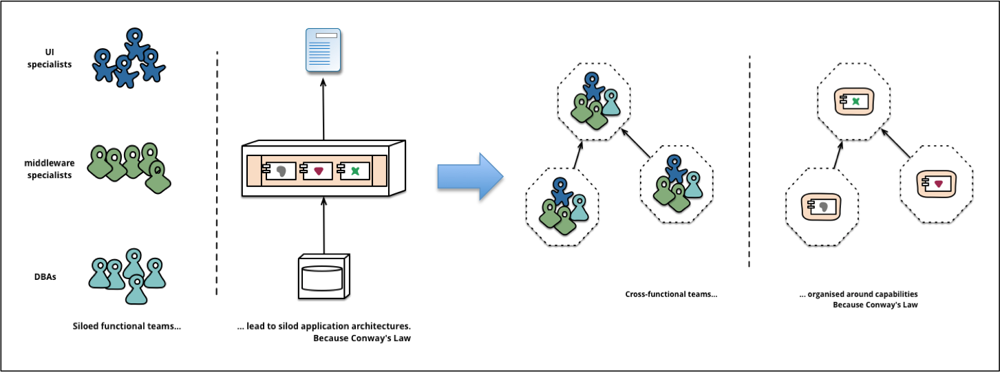
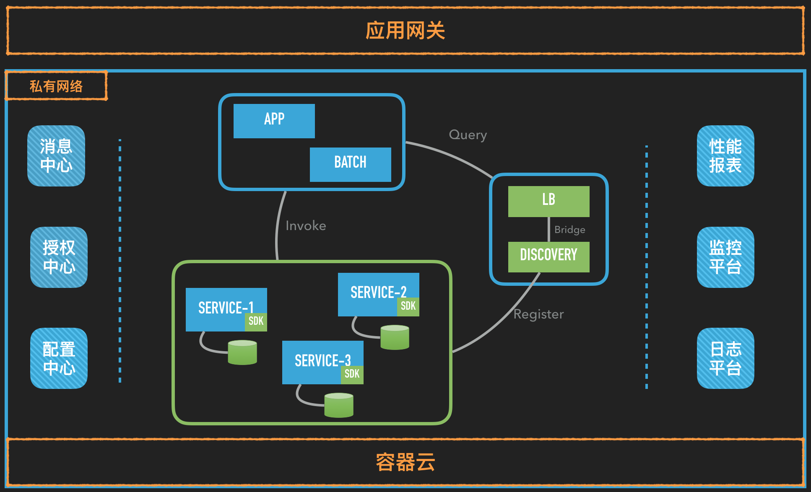

#### 1 写在前面

##### 背景

技术圈流行一句话，凡脱离业务谈架构的，都是耍流氓。作为微服务改造系列的第一篇博客，首先介绍一下实施这次技术改造的背景。

第一，我所在公司（简称XR）的后台服务采用的主技术栈是Scala，虽然开发效率很高，但也带来一系列的副作用。1.由于Scala语言强大的表达能力和丰富的函数式特性，很容易写出俗称“意大利面条”式的代码，一个类文件动辄上千行，代码的可读性非常差，导致可维护性也很差。2.编译Scala源码时首先需要将Scala源码转换成Java源码然后再通过JVM进行编译，加上隐式类型的存在进一步拖慢了编译期间的类型推导，Scala的编译速度比Java足足慢了一个数量级，这个差异在代码量少的时候还不明显，但随着代码量的上升，就成了团队的一个nightmare，试想本地全量编译一次需要10+分钟。3.Scala小众语言的标签决定了Scala程序员的稀缺性，晦涩难懂的官方文档拔高了学习曲线，后果就是高昂的招聘成本和漫长的培养时间。以上这些副作用不但抵消了先期开发效率上的优势，而且使得对新需求的响应能力越来越慢，技术负债也越垒越高。

第二，历经2年多的产品迭代，整个后台服务项目越来越庞大，已经成为一个典型意义上的单体应用（也就是Martin Fowler常说的monolithic application）：1.各个业务模块犬牙交错，重复代码随处可见，补丁代码越打越多。2.任何一个改动都需要一次全量发布，哪怕是修改一句文案。

第三，与微服务化改造同时进行的是容器化改造，如果不对上述单体应用进行拆分，很多容器化带来的好处就会被削弱，甚至毫无意义，比如提高资源利用率（CPU型应用和内存型应用搭配部署），异构应用的环境隔离能力等。

##### 限制

谷歌前研发总监Tiger曾经说过，一个系统的演化一般会经历三个阶段，首先是under-engineer，然后是over-engineer，最后才是right-engineer。考虑到参与此次微服务改造的人员有限（一人主导，多人配合），同时也是团队第一次尝试做这类系统性的改造，最后我们决定采取一条比较实用的改良式路线：

1. 最小化对已有应用的侵入性
2. 偏好主流的微服务框架
3. 只做必要的微服务治理

第一条定下了此次改造的基调，降低了方案无法落地的风险，确保了项目的整体可行性。第二条让我们站在巨人的肩膀上，不重复造轮子，聚焦在问题本身，而不是工具。第三条缩减项目范围，避免过度工程，以战养兵，不打无用之仗。

#### 2 微服务简介

##### 3个关键词

有关微服务的定义，最权威的版本莫属微服务之父Martin Fowler在[microservices](http://martinfowler.com/microservices/)一文中所述：

> In short, the microservice architectural style is an approach to developing a single application as a suite of small services, each running in its own process and communicating with lightweight mechanisms, often an HTTP resource API. These services are built around business capabilities and independently deployable by fully automated deployment machinery. -- James Lewis and Martin Fowler

注意其中有3个关键词，small，independently deployable和automated deployment。small对应的就是微服务的微，很多初次接触微服务的同学对微的理解往往会停留在实现层面，以为代码少就是微，但实际上，这里的微更多的是体现在逻辑层面。微服务的一个重要设计原则是share as little as possible，什么意思呢？就是说每个微服务应该设计成边界清晰不重叠，数据独享不共享，也就是我们常说的高内聚、低耦合。保证了small，才能做到independently deployable。而实现automated deployment的关键是DevOps文化，可参见Fowler另一篇谈[DevOps](http://martinfowler.com/bliki/DevOpsCulture.html)的文章。

需要提醒的是，随着业务复杂度的上升，一个微服务可能需要拆分为更多更细粒度的微服务，比方说，一开始只是一个简单的订单服务，后面逐步拆分出清算，支付，结算，对账等其他服务。

##### 康威定律

与单体应用拆分为微服务的过程类似，随着公司规模的不断扩大，一个组织势必会分化出多个更小的组织。根据康威定律，组织结构决定系统结构，因此，从这个层面来说，微服务也是一种必然。

> 康威定律（Conway’s Law）：“Any organization that design a system (defined broadly) will produce a design whose structure is a copy of the organization’s communication structure. - Melvin Conway, 1968

##### 取舍

从本质上来看，相对单体应用，微服务是以牺牲强一致性、提高部署复杂性为代价，换取更彻底的分布式特性，比如异构性和强隔离性。对应CAP理论，就是用Consistency换Partition。异构性比较容易理解，通过定义统一的API规范（一般采用REST风格），每个微服务团队可以根据各自的能力矩阵选用最适合的技术栈，而不是所有人必须使用相同的技术栈。强隔离性指的是，对于一个典型的单体应用，隔离性最高只能体现到模块级别，由于共享同一个代码仓库，模块的边界往往比较模糊，需要人为定义很多规范来保证良好的隔离性，但无论如何强调，稍一疏忽，就会产生“越界”行为，时间愈长，维护隔离性的成本愈高。而到了微服务阶段，自带应用级别的隔离性，“越界”的成本大大提升，无需任何规范，架构本身就保证了隔离性。

另一方面，由于采用了分布式架构，微服务无法再简单的通过数据库事务来保证强一致性，而是通过消息中间件或者某种事务补偿机制来保证最终一致性，比如微信朋友圈的点赞，淘宝订单的物流状态。其次，在微服务阶段，随着应用数量的激增，一次发布往往涉及多个应用，加上异构性带来的部署方式的多样性，对团队的运维水平尤其是自动化水平提出了更高的要求，运维和开发的边界进一步模糊。

##### 领域知识

除了组织架构和技术取舍，领域知识是另一个非常重要的决策因素。对于不熟悉的业务领域，很难第一次就把各个微服务的边界和接口定义正确，一旦开始开发，重构成本就会非常可观。反过来说，当对领域知识有了一定的积累，再重构一个单体应用就会容易的多。

##### 总结

综上所述，虽然微服务看上去很美，但在决定采用微服务架构之前，不仅要仔细考量团队的技术水平（包括知识结构，理论深度，经验积累和技术氛围），还应综合考虑项目的时间范围，领域知识的熟悉程度，以及所在组织的规模架构。除非这些前提条件都满足，否则单体应用是更适合的选择，就像Fowler[建议](http://martinfowler.com/bliki/MonolithFirst.html)的那样。

#### 3 微服务化总览

上图是XR微服务化第一阶段的整体架构图。可以看到，一些支撑微服务的必要组件都已包含其中：

- 服务注册中心：所有服务注册到Consul集群，集成Nginx实现负载均衡，使用Hystrix实现简单的服务降级和熔断机制
- CI/CD：利用[Jenkins Pipeline](http://emacoo.cn/blog/jenkins-pipeline-tips)实现[不停机发布](http://emacoo.cn/blog/ci-cd-hot-deployment)
- 日志平台：扩展ELK加上Redis缓存
- 配置中心：使用自研的[Matrix](https://zybuluo.com/emac/note/241756)系统，最小化对已有应用的侵入性，保证异构系统的兼容性
- 授权中心：基于Spring Security OAuth，同时支持SSO
- 消息中心：选用RabbitMQ作为消息中间件
- 监控平台：利用Consul API获取服务状态，通过Zookeeper触发告警

在微服务化系列的后续文章中，我会针对服务注册、配置中心、授权中心和服务监控分别展开介绍实施过程中的一些细节和经验。敬请期待。

#### 参考

- [Microservices Resource Guide](http://martinfowler.com/microservices/)
- [An operations model for Microservices](http://callistaenterprise.se/blogg/teknik/2015/03/25/an-operations-model-for-microservices/)
- [实施微服务，我们需要哪些基础框架？](https://mp.weixin.qq.com/s?__biz=MzA5Nzc4OTA1Mw==&mid=407641457&idx=1&sn=183d27056f3bd8ef17e77a3c15dfb3dd)
- [架构的本质是管理复杂性，微服务本身也是架构演化的结果](http://mp.weixin.qq.com/s?__biz=MzA5Nzc4OTA1Mw%3D%3D&from=timeline&idx=1&isappinstalled=0&mid=411129391&scene=2&sn=ebf06fb5cc4a5f57f86341ba4114cab8&srcid=0409K1M3NlgPnoCzUXN8wiFP)
- [应用架构一团糟？如何将单体应用改造为微服务](http://mp.weixin.qq.com/s?__biz=MzA4MzQ1NjQ5Nw%3D%3D&idx=1&mid=402005063&sn=6b714f647c29afb15598a1ca3dbd78c2)
- [一个值得参考的服务化体系改造案例](http://mp.weixin.qq.com/s?__biz=MzIwMjE5MDU4OA==&mid=2653119912&idx=1&sn=d3b08b362de3d895fe0a088dcdc2380c&scene=23&srcid=0806PBMw9lhxnOpEJhLYuvCC#rd)
- [华为实施微服务架构的五大军规](http://mp.weixin.qq.com/s?__biz=MjM5MDE0Mjc4MA==&idx=1&mid=2650993889&scene=0&sn=3d8edd0fa55be53d85235212be3a9505)
