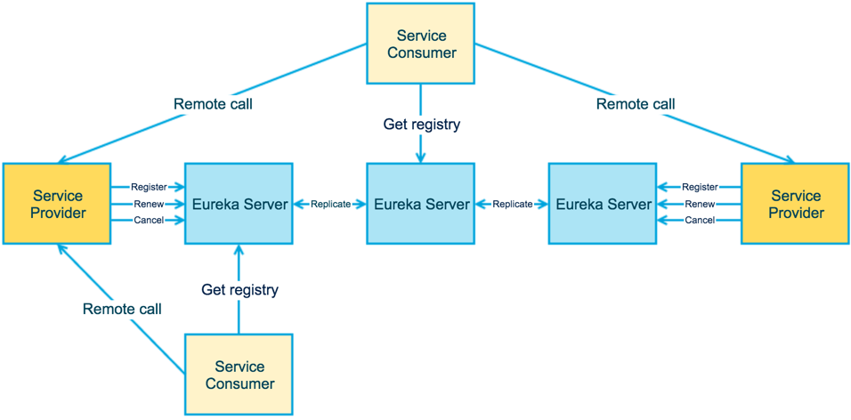

> 前情概要：[微服务化改造系列之一：总览](http://emacoo.cn/blog/microservice-overview)

#### 服务注册中心概述

这篇文章是微服务化改造系列的第二篇，主题是服务注册中心。作为微服务架构最基础也是最重要的组件之一，服务注册中心本质上是为了解耦服务提供者和服务消费者。对于任何一个微服务，原则上都应存在或者支持多个提供者，这是由微服务的分布式属性决定的。更进一步，为了支持弹性扩缩容特性，一个微服务的提供者的数量和分布往往是动态变化的，也是无法预先确定的。因此，原本在单体应用阶段常用的静态LB机制就不再适用了，需要引入额外的组件来管理微服务提供者的注册与发现，而这个组件就是服务注册中心。

设计或者选型一个服务注册中心，首先要考虑的就是服务注册与发现机制。纵观当下各种主流的服务注册中心解决方案，大致可归为三类：

- 应用内：直接集成到应用中，依赖于应用自身完成服务的注册与发现，最典型的是Netflix提供的[Eureka](https://github.com/Netflix/eureka)
- 应用外：把应用当成黑盒，通过应用外的某种机制将服务注册到注册中心，最小化对应用的侵入性，比如Airbnb的[SmartStack](http://nerds.airbnb.com/smartstack-service-discovery-cloud/)，HashiCorp的[Consul](https://www.consul.io/)
- DNS：将服务注册为DNS的SRV记录，严格来说，是一种特殊的应用外注册方式，[SkyDNS](https://github.com/skynetservices/skydns)是其中的代表

_注1：对于第一类注册方式，除了Eureka这种一站式解决方案，还可以基于ZooKeeper或者Etcd自行实现一套服务注册机制，这在大公司比较常见，但对于小公司而言显然性价比太低。_

_注2：由于DNS固有的缓存缺陷，本文不对第三类注册方式作深入探讨。_

除了基本的服务注册与发现机制，从开发和运维角度，至少还要考虑如下五个方面：

- 测活：服务注册之后，如何对服务进行测活以保证服务的可用性？
- 负载均衡：当存在多个服务提供者时，如何均衡各个提供者的负载？
- 集成：在服务提供端或者调用端，如何集成注册中心？
- 运行时依赖：引入注册中心之后，对应用的运行时环境有何影响？
- 可用性：如何保证注册中心本身的可用性，特别是消除单点故障？

以下就围绕上述几个方面，简单分析一下Eureka，SmartStack，Consul的利弊。

##### Eureka

从设计角度来看，Eureka可以说是无懈可击，注册中心、提供者、调用者边界清晰，通过去中心化的集群支持保证了注册中心的整体可用性，但缺点是Eureka属于应用内的注册方式，对应用的侵入性太强，且只支持Java应用。

##### SmartStack

SmartStack可以说是三种方案中最复杂的，涉及了ZooKeeper、HAProxy、Nerve和Synapse四种异构组件，对运维提出了很高的要求。它最大的好处是对应用零侵入，且适用于任意类型的应用。

##### Consul

Consul本质上属于应用外的注册方式，但可以通过SDK简化注册流程。而服务发现恰好相反，默认依赖于SDK，但可以通过Consul Template（下文会提到）去除SDK依赖。

#### 方案

最终我们选择了Consul作为服务注册中心的实现方案，主要原因有两点：

1. 最小化对已有应用的侵入性，这也是贯穿我们整个微服务化改造的原则之一
2. 降低运维的复杂度，Consul Agent既可以运行在服务器模式，又可以运行在客户端模式

##### Consul Template

上文提到使用Consul，默认服务调用者需要依赖Consul SDK来发现服务，这就无法保证对应用的零侵入性。所幸通过[Consul Template](https://github.com/hashicorp/consul-template)，可以定时从Consul集群获取最新的服务提供者列表并刷新LB配置（比如nginx的upstream），这样对于服务调用者而言，只需要配置一个统一的服务调用地址即可。改造后的调用关系如下：

##### Spring Cloud Consul

由于我们选用了Spring Boot作为统一的微服务实现框架，很自然的，可以利用Spring Cloud提供的Consul组件进一步简化服务注册流程，省去额外的服务提供端的Consul配置。

#### 参考

- [CONSUL DOCUMENTATION](https://www.consul.io/docs/index.html)
- [consul-template](https://github.com/hashicorp/consul-template)
- [Spring Cloud Consul](http://cloud.spring.io/spring-cloud-consul/)
- [Spring Cloud Netflix](http://cloud.spring.io/spring-cloud-netflix/spring-cloud-netflix.html)
- [Dive into Eureka](http://nobodyiam.com/2016/06/25/dive-into-eureka/)
- [SmartStack: Service Discovery in the Cloud](http://nerds.airbnb.com/smartstack-service-discovery-cloud/)
- [Open-Source Service Discovery](http://jasonwilder.com/blog/2014/02/04/service-discovery-in-the-cloud/)