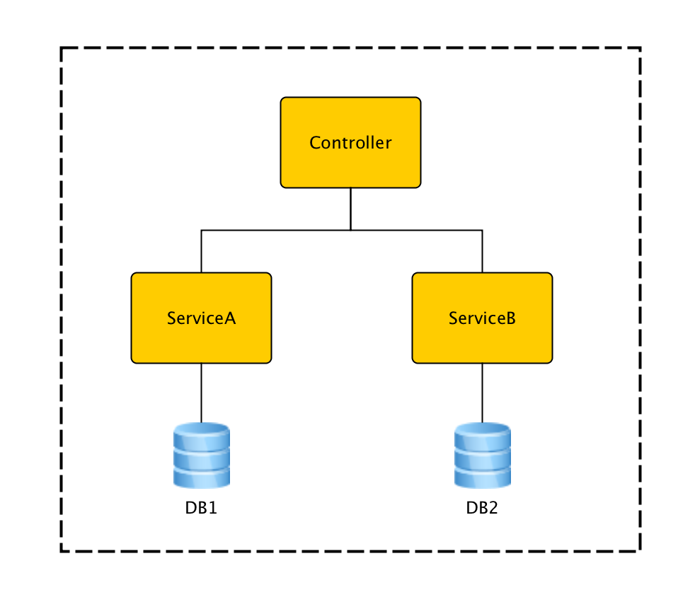

#### 为什么需要多数据库？

默认情况下，Spring Boot使用的是单数据库配置（通过spring.datasource.\*配置具体数据库连接信息）。对于绝大多数Spring Boot应用，这是符合其使用场景的，因为Spring Boot提倡的是微服务理念，每个应用对应一个单独的业务领域。但在某些特殊情况下，一个应用对应多个数据库又是无法避免的，例如实施数据库分库后原本单个数据库变为多个数据库。本文就结合实际代码介绍如何在单个Boot应用中配置多数据库，以及与之相关的Druid，jOOQ，Flyway等数据服务框架的配置改造。

#### 配置示例

- DB1，DB2: 两个示例数据库
- ServiceA, ServiceB: 分别使用DB1和DB2的服务类

##### 连接池Druid

[Druid](https://github.com/alibaba/druid)是阿里巴巴开源的数据库连接池，提供了强大的监控支持，号称Java语言中最好的连接池。

创建两个配置类分别注册对应DB1和DB2的DataSource Bean和TransactionManager Bean。以DB1为例：

> Tip: 可以把其中一个配置类中注册的DataSource Bean和DataSourceTransactionManager Bean加上@Primary注解，作为默认装配实例。

    // DB1
    @Configuration
    public class Db1Config {

	    @Bean(initMethod = "init", destroyMethod = "close")
	    @ConfigurationProperties(prefix = "db.db1")
	    public DataSource dataSource1() {
	        return new DruidDataSource();
	    }

	    @Bean
	    public DataSourceTransactionManager transactionManager1() {
	        DataSourceTransactionManager transactionManager = new DataSourceTransactionManager();
	        transactionManager.setDataSource(dataSource1());
	        return transactionManager;
        }
    }

application.conf中的配置：

    # DB1
    db.db1.url=jdbc:mysql://127.0.0.1:3306/db1?useUnicode=true&characterEncoding=UTF-8&rewriteBatchedStatements=true
    db.db1.username=root
    db.db1.password=

##### ORM框架jOOQ

[jOOQ](http://www.jooq.org/)是一个开源ORM框架，最大特点是提供类型安全的流式API，支持代码生成。

参照Boot自带的JooqAutoConfiguration，不难写出如下配置类：

    @Configuration
	public class JooqConfig {

	    // DB1
	    @Bean
	    public DataSourceConnectionProvider dataSourceConnectionProvider1(
	            @Qualifier("dataSource1") DataSource dataSource1) {
	        return new DataSourceConnectionProvider(
	                new TransactionAwareDataSourceProxy(dataSource1));
	    }

	    @Bean
	    public SpringTransactionProvider transactionProvider1(
	            @Qualifier("transactionManager1") DataSourceTransactionManager txManager1) {
	        return new SpringTransactionProvider(txManager1);
	    }

	    // DB2
	    // ...

	    @Configuration
	    public static class DslContextConfig {

	        @Autowired(required = false)
	        private RecordMapperProvider recordMapperProvider;

	        @Autowired(required = false)
	        private Settings settings;

	        @Autowired(required = false)
	        private RecordListenerProvider[] recordListenerProviders;

	        @Autowired
	        private ExecuteListenerProvider[] executeListenerProviders;

	        @Autowired(required = false)
	        private VisitListenerProvider[] visitListenerProviders;

			// DSLContext for DB1
	        @Bean
	        public DefaultDSLContext dslContext1(@Qualifier("dataSourceConnectionProvider1") DataSourceConnectionProvider connectionProvider1,
	                                            @Qualifier("transactionProvider1") SpringTransactionProvider transactionProvider1) {
	            return new DefaultDSLContext(configuration(connectionProvider1, transactionProvider1));
	        }

	        // DSLContext for DB2
	        // ...

	        private DefaultConfiguration configuration(ConnectionProvider connectionProvider, TransactionProvider transactionProvider) {
	            DefaultConfiguration configuration = new DefaultConfiguration();
	            configuration.setSQLDialect(SQLDialect.MYSQL);
	            configuration.set(connectionProvider);
	            configuration.set(transactionProvider);
	            if (this.recordMapperProvider != null) {
	                configuration.set(this.recordMapperProvider);
	            }
	            if (this.settings != null) {
	                configuration.set(this.settings);
	            }
	            configuration.set(this.recordListenerProviders);
	            configuration.set(this.executeListenerProviders);
	            configuration.set(this.visitListenerProviders);
	            return configuration;
	        }
	    }
	}

##### 服务类

配置好DataSource，TransacationManager和DSLContext之后，服务类的配置就比较简单了，直接引用即可。注意由于存在多套Beans，需要通过@Qualifier注解指定装配实例。

	@Transactional("TransactionManager1")
	public class ServiceA {

	    @Autowired
	    @Qualifier("dslContext1")
	    protected DSLContext dsl;
	}

##### 数据库迁移框架Flyway

[Flyway](https://flywaydb.org/)是一个轻量级的开源数据库迁移框架，使用非常广泛。

参照Boot自带的FlywayAutoConfiguration，同样可以写出如下配置类：

	@Configuration
	public class FlywayConfig {

	    @Bean(initMethod = "migrate")
	    @ConfigurationProperties(prefix = "fw.db1")
	    public Flyway flyway(@Qualifier("dataSource1") DataSource dataSource1) {
	        Flyway clinic = new Flyway();
	        clinic.setDataSource(dataSource1);
	        return clinic;
	    }

	    // DB2
	    // ...

	    /**
	     * @see FlywayAutoConfiguration
	     */
	    @Bean
	    @ConfigurationPropertiesBinding
	    public StringOrNumberToMigrationVersionConverter stringOrNumberMigrationVersionConverter() {
	        return new StringOrNumberToMigrationVersionConverter();
	    }

	    /**
	     * Convert a String or Number to a {@link MigrationVersion}.
	     * @see FlywayAutoConfiguration
	     */
	    private static class StringOrNumberToMigrationVersionConverter
	            implements GenericConverter {

	        private static final Set<ConvertiblePair> CONVERTIBLE_TYPES;

	        static {
	            Set<ConvertiblePair> types = new HashSet<ConvertiblePair>(2);
	            types.add(new ConvertiblePair(String.class, MigrationVersion.class));
	            types.add(new ConvertiblePair(Number.class, MigrationVersion.class));
	            CONVERTIBLE_TYPES = Collections.unmodifiableSet(types);
	        }

	        @Override
	        public Set<ConvertiblePair> getConvertibleTypes() {
	            return CONVERTIBLE_TYPES;
	        }

	        @Override
	        public Object convert(Object source, TypeDescriptor sourceType,
	                              TypeDescriptor targetType) {
	            String value = ObjectUtils.nullSafeToString(source);
	            return MigrationVersion.fromVersion(value);
	        }

	    }
	}

application.conf中的配置：

	# DB1
	fw.db1.enabled=true

#### 关于事务

有经验的同学马上会问，多数据库下事务会不会有问题？需要改造成分布式事务吗？只要为每个数据库创建独立的TransactionManager，就不会有问题，Spring会自动处理好事务的提交和回滚，就像单数据库一样。至于分布式事务，大可不必，因为虽然有多个数据库，但仍然属于Local Transaction范畴。以后有时间我会再写篇文章展开阐述一下。

#### 总结

由上可见，无论是基础的DataSource和TransactionManager，还是Spring之外的第三方框架，在Boot中基本都可以找到相应的AutoConfiguration配置类。参照这些配置类，就不难根据实际需要写出自己的扩展版本。对于那些找不到AutoConfiguration配置类的，可结合框架的官方文档，使用@Configuration和@Bean注解自行进行配置。