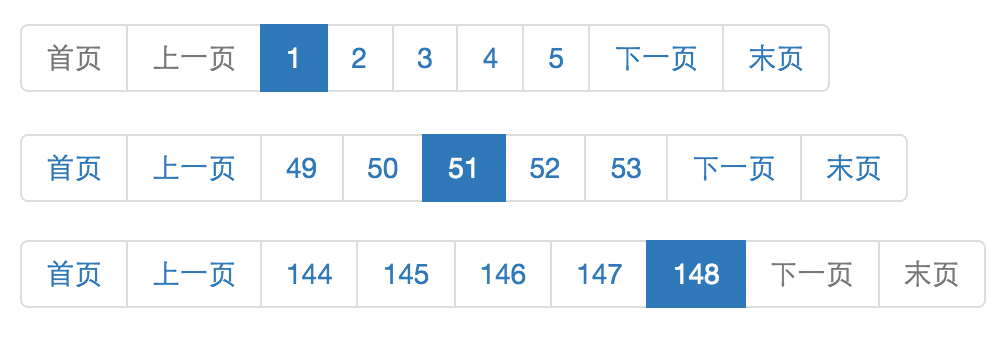

#### 分页的基本模型

做Web应用开发，或早或晚都会涉及到分页。按模型划分，分页包含页码（page），大小（size）和总条数（count），页码和大小面向的是前端页面，而总条数来自后端服务。按表现形式，可分为显式分页和隐式分页（比如上拉加载），显示分页一般用于PC端，而隐式分页一般用于Mobile端。按实现方式，或者由前端JS生成，或者是后端模板。

#### 分页的基本原理

一般而言，分页最终都是映射到数据库查询，在此场景下，不论何种分页框架，其基本原理都是基于SQL的`LIMIT [offset,] row_count`语法（数据库不同语法略有差别）。row_count对应的是size，而offset则是通过page\*size计算得到（假设page从0计数），比如(page=1, size=10)对应(offset=10, row_count=10)。

介绍了分页的基本模型和原理后，接下来我结合一个基于Spring Data JPA的分页组件，阐述分页的一些实现要点。

#### 分页的实现要点

首先看一个典型的分页效果：

整个分页组件由三部分组成，首页|上一页，下一页|末页，以及中间的页码组。显然，前两部分是固定的，而页码组是随着当前页码的变化而变化。其实现要点有三个，

- 计算页码组：首先比较页码组默认长度和总页数，取较小值为页码组最终长度（L）。然后根据当前页码（P）和总页数（T）的关系，再细分为三种情况
	- P+L/2<=L: 页码组从1开始计数，比如(P=2, T=6, L=5) -> 1,2,3,4,5
	- P+L>=T: 页码组从T倒数L开始计数，比如(P=5, T=6, L=5) -> 2,3,4,5,6
	- 其他: 页码组从P-L/2+1开始计数，比如(P=4, T=6, L=5) -> 2,3,4,5,6
- 按钮状态：首页，上一页，下一页，末页对应按钮的启用状态应随当前页码的值变化而变化，并且当前页码对应的按钮应该始终处于禁用状态。
- 页码显示：页面显示是从1开始，而数据库查询是从0开始。这一点不想清楚，边界情况就处理不好。

具体实现细节，可参考我GitHub的一个示例项目，[Pagination](https://github.com/emac/pagination)。

#### Spring Data JPA简介

[Spring Data JPA](http://projects.spring.io/spring-data-jpa/)隶属于[Spring Data](http://projects.spring.io/spring-data/)项目，通过一系列Spring风格的接口和注解，极大的简化了创建和开发JPA Repository的过程，同时提供了自定义查询，分页排序等高级特性的支持。

#### 参考

- [Spring Data Commons - Reference Documentation](http://docs.spring.io/spring-data/commons/docs/current/reference/html/)