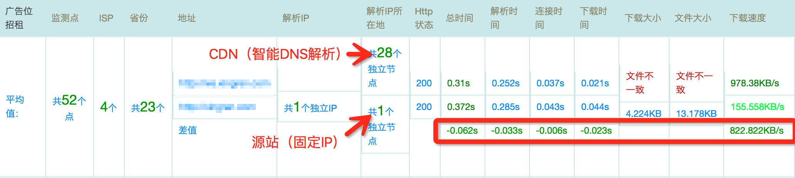
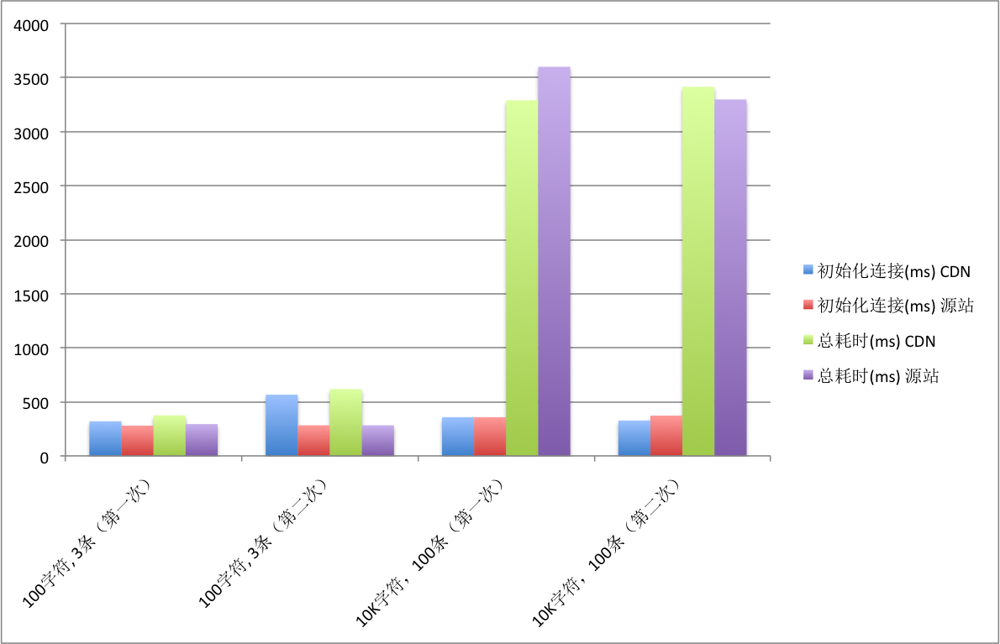

#### 1. 什么是CDN？

> CDN的全称是Content Delivery Network，即内容分发网络。其目的是通过在现有的Internet中增加一层新的CACHE(缓存)层，将网站的内容发布到最接近用户的网络"边缘"的节点，使用户可以就近取得所需的内容，提高用户访问网站的响应速度。从技术上全面解决由于网络带宽小、用户访问量大、网点分布不均等原因，提高用户访问网站的响应速度。
> http://www.51know.info/system_performance/cdn/cdn.html

可以认为，CDN就是加上了智能DNS和缓存层的反向代理集群。由于智能DNS能够根据请求的来源定位到离用户较近的缓存服务器，因此有效的缩短了连接时间，而缓存层的存在极大的提高了下载速度，并且不再受限于源站的带宽大小。注意上述第二点仅针对静态资源有意义，对于动态内容（比如POST请求，WebSocket连接），CDN仍然需要将请求发回源站再将结果返回，并不能起到加速作用。下面就针对上述分析进行实验验证。

#### 2. 环境准备

- 源站，提供静态页面和WebSocket服务。
- CDN，使用腾讯云CDN服务，仅对静态页面设置缓存。

#### 3. 基准测试

##### 3.1 静态页面

如下图所示，使用CDN之后，无论是连接时间还是下载时间都明显缩短，下载速度也有**5倍**以上的提速。

测速网站：http://www.17ce.com/

##### 3.2 动态内容

选择一台远离源站的服务器，运行Node基准测试，先后与源站和CDN站建立WebSocket连接，发送消息，计算总耗时。测试结果显示，与直连源站相比，使用CDN并没有起到加速效果，反而有所下降。不难理解，这是因为去掉缓存之后，CDN平白在用户和源站之间多加了一层链路。

#### 4. 参考

- http://www.51know.info/system_performance/cdn/cdn.html
- http://www.qcloud.com/wiki/CDN%E4%BB%8B%E7%BB%8D